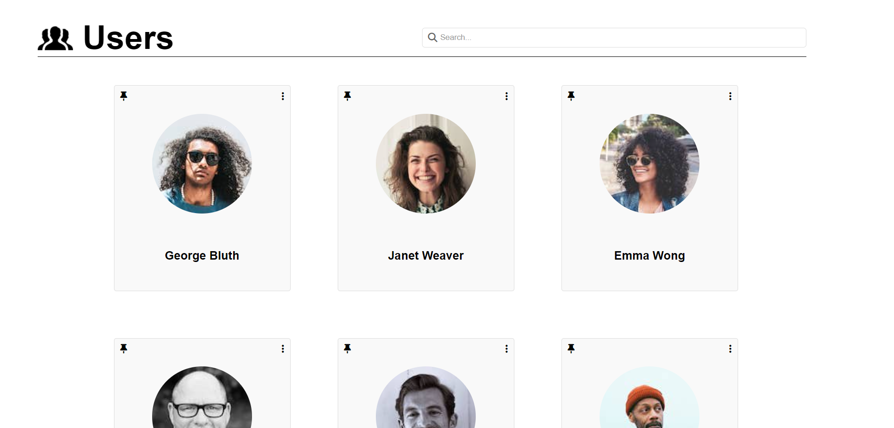
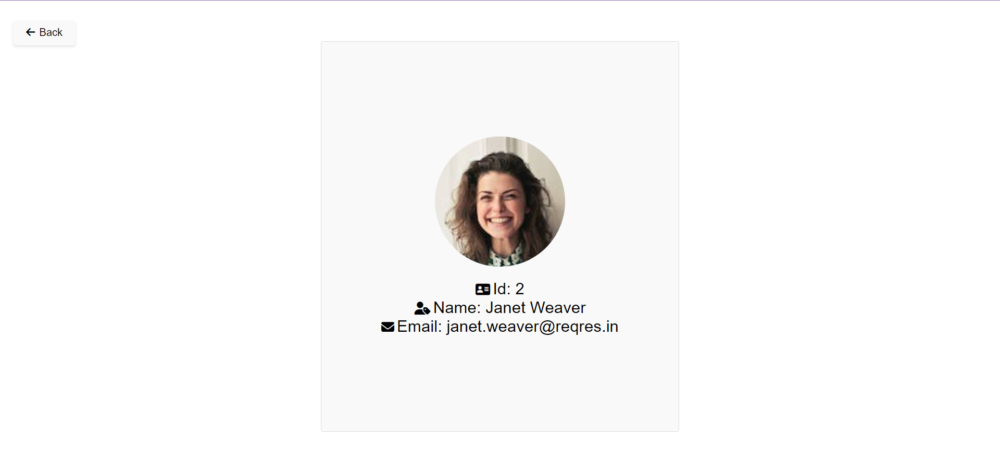
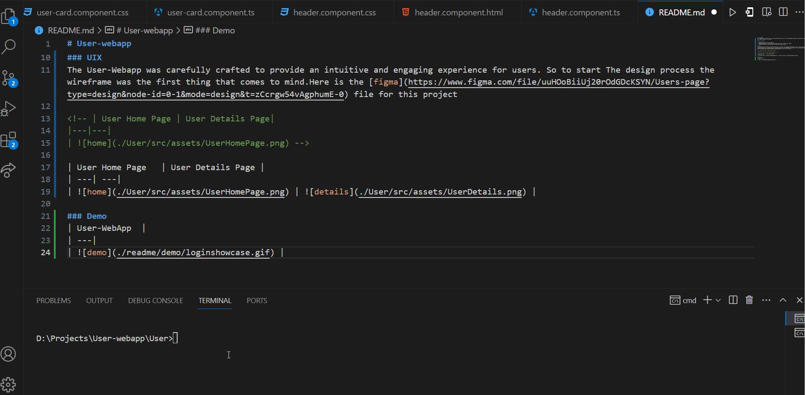

# User-webapp
this repository will hold the user web app containing bunch of cards representing different users,where you click on a card and it give you specific details for the user

### Key Feautures

1. Engaging Dynamic UI With Animations
2. Fetched Data From 3rd party API and represented in User Friendly Card Layout
3. Spinner animation for the waiting time after receiving the Data

### UIX 
The User-Webapp was carefully crafted to provide an intuitive and engaging experience for users. So to start The design process the wireframe was the first thing that comes to mind.Here is the [figma](https://www.figma.com/file/uuHOoBiiUj20rOdGDcKSYN/Users-page?type=design&node-id=0-1&mode=design&t=zCcrgw54vAgphumE-0) file for this project

<!-- | User Home Page | User Details Page|
|---|---|
|  -->

| User Home Page   | User Details Page |
| ---| ---| 
|  |  | 

### Demo 
| User-WebApp  |
| ---|
|  |

### Installation 
> To run the User-WebApp project locally, follow these steps:

1. Clone the repo
   ```sh
   git clone https://github.com/AhmadSerhall/User-webapp
   ```
2. Navigate to the User folder
   ```sh
   cd User
   ```
3. Run the project
```sh
   ng serve --open
   ```
